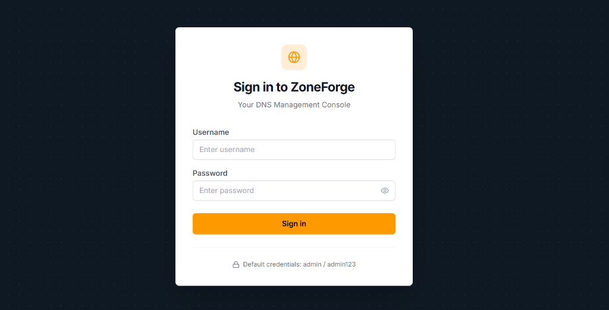
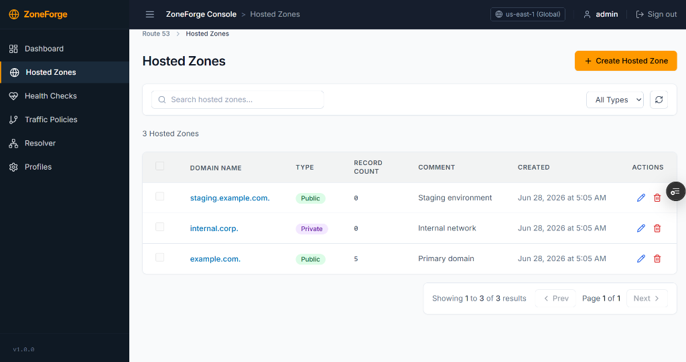

# 🌐 ZoneForge — Enterprise DNS Management Console

[](https://nextjs.org/)
[](https://fastapi.tiangolo.com/)
[](https://www.typescriptlang.org/)
[](https://www.postgresql.org/)
[](https://www.sqlite.org/)

> A high-fidelity, pixel-perfect clone of the **AWS Route 53** Management Console. Engineered as a full-stack monorepo featuring a responsive Next.js frontend, a high-performance FastAPI backend, and a dual-database engine (SQLite for local development, PostgreSQL for production).

---

## 📂 Repository Structure

The actual project files, including the frontend and backend codebase, are located inside the nested **[Zoneforge/](Zoneforge/)** directory:

* 📝 **[Main Project README](Zoneforge/README.md)**: Refer here for detailed environment setup, run instructions, and database details.
* 💻 **[Frontend (Next.js)](Zoneforge/frontend/)**: Next.js TypeScript application simulating the AWS console interface.
* ⚙️ **[Backend (FastAPI)](Zoneforge/backend/)**: FastAPI REST API handling hosted zones, DNS records, and IAM authentication sessions.
* 📖 **[Technical Documentation](Zoneforge/technical_documentation.md)**: Deep-dive details on application architecture, state design, and data schemas.

---

## 🚀 Live Deployments

* **Frontend Console**: [https://zone-forge.vercel.app/](https://zone-forge.vercel.app/)
* **Backend REST API**: [https://zoneforge-backend.onrender.com/](https://zoneforge-backend.onrender.com/)
* **API Documentation**: [https://zoneforge-backend.onrender.com/docs](https://zoneforge-backend.onrender.com/docs) (Interactive Swagger UI)

---

## 📸 Screenshots

| AWS-Style Login | Hosted Zones Dashboard |
| :---: | :---: |
|  |  |

---

## 🛠️ Quick Start

To run this project locally, navigate into the nested **`Zoneforge`** subdirectory and follow the instructions in [Zoneforge/README.md](Zoneforge/README.md):

```bash
# Clone the repository
git clone https://github.com/AdityaAnnaboina/ZoneForge.git

# Navigate to the project root directory
cd ZoneForge/Zoneforge
```

### 1. Backend Setup
```bash
cd backend
python -m venv venv

# Activate Virtual Environment (Windows PowerShell)
.\venv\Scripts\Activate.ps1

# Install Dependencies
pip install -r requirements.txt

# Run Development Server
uvicorn main:app --reload --port 8000
```

### 2. Frontend Setup
```bash
cd ../frontend
npm install
cp .env.local.example .env.local
npm run dev
```

For more detailed information, please read the **[full project README](Zoneforge/README.md)**.
