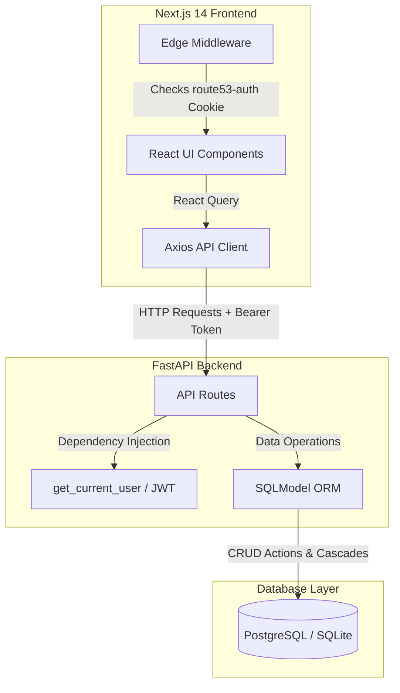
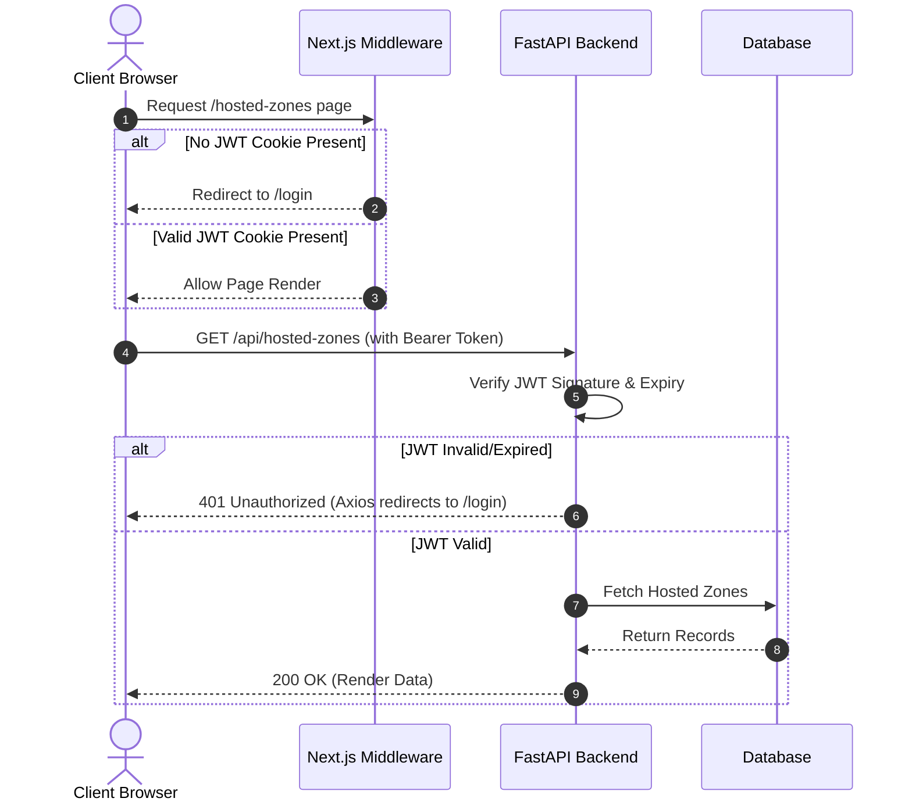

# 🌐 ZoneForge — Enterprise DNS Management Console

[](https://nextjs.org/)
[](https://fastapi.tiangolo.com/)
[](https://www.typescriptlang.org/)
[](https://www.postgresql.org/)
[](https://www.sqlite.org/)
[](LICENSE)

> A high-fidelity, pixel-perfect clone of the **AWS Route 53** Management Console. Engineered as a full-stack monorepo featuring a responsive Next.js frontend, a high-performance FastAPI backend, and a dual-database engine (SQLite for local development, PostgreSQL for production).

---

## 🚀 Live Deployments

* **Frontend Console**: [https://zone-forge.vercel.app/](https://zone-forge.vercel.app/)
* **Backend REST API**: [https://zoneforge-backend.onrender.com/](https://zoneforge-backend.onrender.com/)
* **API Documentation**: [https://zoneforge-backend.onrender.com/docs](https://zoneforge-backend.onrender.com/docs) (Interactive Swagger UI)

---

## 📝 Project Overview

**ZoneForge** is a functional recreation of the AWS Route 53 web interface. It simulates the core workflows of cloud DNS management, focusing heavily on delivering an authentic AWS User Experience (UX).

While actual DNS packet resolution is out of scope for this assignment, the project implements complete, secure, and persistent CRUD management of **Hosted Zones** and **DNS Records** (supporting 9 standard record types) under a mocked AWS IAM authentication session.

---

## 📸 Screenshots

*(Mocked layout of the visual interface. Add your actual screenshots here)*

| AWS-Style Login | Hosted Zones Dashboard |
| :---: | :---: |
|  |  |

---

## ✨ Features

### 🔐 Authentication & Security
* **Mocked AWS IAM Session**: Secure login/logout using standard credentials.
* **JWT Cookie Session Persistence**: Stateless authentication utilizing secure, HTTP-only cookie signing.
* **Edge-Level Route Guards**: Next.js middleware intercepts requests at the network edge, blocking unauthenticated access to the console.

### 📁 Hosted Zone Management
* **Full CRUD Lifecycle**: Create, view, search, and delete Public and Private hosted zones.
* **Metadata Trackers**: Automatic creation and update timestamps with description/comment fields.
* **Automatic Record Counters**: Seamless, real-time synchronization of zone record counts upon record creation or deletion.

### ⚙️ DNS Record Management
* **Comprehensive Record Types**: Support for **`A`**, **`AAAA`**, **`CNAME`**, **`TXT`**, **`MX`**, **`NS`**, **`PTR`**, **`SRV`**, and **`CAA`** records.
* **Multiline Values**: Support for entering multiple IP addresses or text strings per record.
* **Route 53 Specific Fields**: Configuration of Time-to-Live (TTL) values and Routing Policies (Simple, Weighted, etc.).

### 🎨 Route 53 Experience
* **AWS Console Theme**: Replicated color schemes (AWS slate `#0f1923` and accent orange `#FF9900`).
* **Advanced Tables**: Scrollable tables with pagination, search querying, and type filtering.
* **Interactive Modals**: Seamless creation and deletion modals with confirm-input safety checks (e.g., typing the zone name to confirm deletion).

---

## 🏗️ Architecture & Request Flow

The monorepo connects three distinct layers: Next.js (Client), FastAPI (Application Server), and a SQL Datastore.

### System Architecture


### Authentication Request Flow


---

## 🛠️ Technology Stack

| Layer | Technology | Version | Rationale |
| :--- | :--- | :--- | :--- |
| **Frontend** | **Next.js** | `14.x` | Enables App Router, file-system routing, and Edge Middleware. |
| **State** | **Zustand** | `4.x` | Ultra-lightweight client state management with external store access. |
| **Queries** | **React Query** | `5.x` | Automated caching, background refetching, and query invalidation. |
| **Forms** | **React Hook Form** | `7.x` | High-performance form handling with minimal component re-renders. |
| **Validation**| **Zod** | `3.x` | Runtime schema validation for client inputs. |
| **Backend** | **FastAPI** | `0.109.x` | High-performance Python framework with native async and OpenAPI docs. |
| **ORM** | **SQLModel** | `0.0.14` | Combines Pydantic (data parsing) and SQLAlchemy (ORM) into a single model. |
| **Database** | **PostgreSQL** | `16` | Relational storage for production (Neon). |
| **Database** | **SQLite** | `3` | Zero-configuration file database for local development. |

---

## 📂 Project Structure

```text
zoneforge/
├── backend/                    # FastAPI Python Backend
│   ├── main.py                 # Application entrypoint & CORS config
│   ├── database.py             # Database engine, session maker, and seeding
│   ├── dependencies.py         # JWT token signing & auth dependencies
│   ├── models/                 # SQLModel database tables
│   │   ├── user.py             # User accounts table
│   │   ├── hosted_zone.py      # Hosted Zones table
│   │   └── dns_record.py       # DNS Records table
│   ├── schemas/                # Pydantic validation schemas
│   │   ├── auth.py
│   │   ├── hosted_zones.py
│   │   └── dns_records.py
│   ├── routes/                 # Endpoint controllers
│   │   ├── auth.py
│   │   ├── hosted_zones.py
│   │   └── dns_records.py
│   └── requirements.txt        # Python package dependencies
└── frontend/                   # Next.js TypeScript Frontend
    ├── src/
    │   ├── middleware.ts       # Edge route guard middleware
    │   ├── lib/                # Axios & React Query configurations
    │   ├── store/              # Zustand auth & layout state stores
    │   ├── components/         # Reusable UI widgets & Modals
    │   └── app/                # App Router pages and layouts
    ├── package.json            # Node.js package manifests
    └── tailwind.config.ts      # Tailwind styling presets
```

---

## ⚙️ Installation & Setup

### Prerequisites
* **Node.js** (v18.0.0 or higher)
* **Python** (v3.9.0 to v3.12.x)

### 1. Clone the Repository
```bash
git clone https://github.com/AdityaAnnaboina/ZoneForge.git
cd ZoneForge/Zoneforge
```

### 2. Backend Setup
```bash
cd backend
python -m venv venv

# Activate Virtual Environment
# On Windows (PowerShell):
.\venv\Scripts\Activate.ps1
# On Linux/macOS:
source venv/bin/activate

# Install Dependencies
pip install -r requirements.txt

# Run Development Server
uvicorn main:app --reload --port 8000
```
* The backend will run at: **`http://localhost:8000`**
* Interactive Swagger API Docs: **`http://localhost:8000/docs`**

### 3. Frontend Setup
```bash
cd ../frontend

# Install Dependencies
npm install

# Configure Environment Variables
cp .env.local.example .env.local

# Run Development Server
npm run dev
```
* The frontend will run at: **`http://localhost:3000`**

---

## 💾 Database Information

ZoneForge uses **SQLModel** for its database layer. It is designed to run on **SQLite** locally (persisted as `backend/route53.db`) and automatically switches to **PostgreSQL** in production when the `DATABASE_URL` environment variable is detected.

### Seeding
On the first application startup, if the database is empty, it automatically seeds:
* **1 Admin User**: `admin` / `admin123` (password hashed using Bcrypt with 12 rounds).
* **3 Sample Hosted Zones**: `example.com.`, `internal.corp.`, and `staging.example.com.`.
* **5 Sample DNS Records**: Initialized under `example.com.` (`A`, `CNAME`, `MX`, `TXT`, `NS`).

---

## 🔌 API Overview

### Authentication
* `POST /api/auth/login` — Sign in and receive a JWT token.
* `POST /api/auth/logout` — Revoke the session.
* `GET /api/auth/me` — Retrieve the current authenticated user.

### Hosted Zones
* `GET /api/hosted-zones` — List hosted zones (Supports pagination, search, and type filter).
* `POST /api/hosted-zones` — Create a new hosted zone.
* `GET /api/hosted-zones/{id}` — Get details for a specific zone.
* `PUT /api/hosted-zones/{id}` — Update zone comments or type.
* `DELETE /api/hosted-zones/{id}` — Delete a zone (Cascades and deletes all child DNS records).

### DNS Records
* `GET /api/hosted-zones/{zone_id}/records` — List records in a zone (Supports pagination and search).
* `POST /api/hosted-zones/{zone_id}/records` — Create a new DNS record.
* `PUT /api/hosted-zones/{zone_id}/records/{id}` — Edit a DNS record.
* `DELETE /api/hosted-zones/{zone_id}/records/{id}` — Delete a DNS record.

<details>
<summary><b>🔍 Click to view Example API Requests (cURL)</b></summary>

#### Login Request
```bash
curl -X 'POST' \
  'http://localhost:8000/api/auth/login' \
  -H 'Content-Type: application/json' \
  -d '{
  "username": "admin",
  "password": "admin123"
}'
```

#### Create Hosted Zone
```bash
curl -X 'POST' \
  'http://localhost:8000/api/hosted-zones' \
  -H 'Authorization: Bearer <YOUR_JWT_TOKEN>' \
  -H 'Content-Type: application/json' \
  -d '{
  "name": "mycompany.com",
  "type": "Public",
  "comment": "Corporate main site"
}'
```
</details>

---

## 💡 Technical Design Decisions

* **Zustand + React Query**: Rather than using a heavy global state manager like Redux, client-only UI states (such as active auth session and layout expansion) are managed in Zustand. Server-state caching and background data synchronization are offloaded to React Query.
* **Next.js Edge Middleware**: Protecting routes on the client side can lead to layout flashes. By checking JWT cookie signatures at the Next.js Middleware layer, we prevent unauthenticated page compilation entirely.
* **Denormalized Record Counter**: Querying `COUNT(*)` across millions of DNS records in a relational database during a zone list query is extremely expensive. We denormalized this by adding a `record_count` column to the `HostedZone` model, which is updated in $O(1)$ time whenever records are created or deleted.

---

## ⚠️ Known Limitations & Future Improvements

### Limitations
* **No Live DNS Resolution**: The application acts purely as a management dashboard; it does not bind to port 53 or resolve real-world DNS queries.
* **Bcrypt 72-Byte Limit**: The underlying `bcrypt` library enforces a maximum password length of 72 bytes.

### Future Roadmap
1. **BIND File Import/Export**: Allow users to upload standard BIND zone files to populate records in bulk.
2. **Bulk Record Operations**: Implement multi-select checkboxes to delete or edit multiple DNS records simultaneously.
3. **CoreDNS/BIND Integration**: Integrate a real DNS resolver daemon in the backend to make the records resolvable on a local network.

---

## 🤝 Contributing & License

### Contributing
Contributions are welcome! Please fork the repository, make your changes on a feature branch, and submit a Pull Request.

### License
This project is open-source and licensed under the [MIT License](LICENSE).

### Acknowledgements
* Inspired by the design and layout of the official **Amazon Web Services (AWS) Route 53** Console.
* Hosted on **Vercel** (Frontend), **Render** (Backend), and **Neon** (PostgreSQL).
