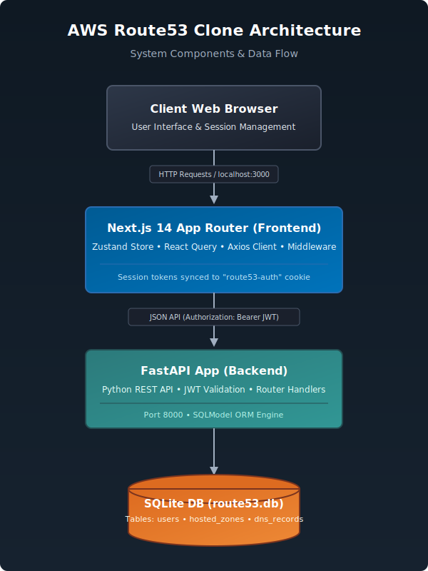

# ZoneForge — DNS Management Console

> A functional clone of AWS Route53 built with Next.js, FastAPI, and SQLite

## Features
- [x] **Full Authentication**: Secure signup, login, and session checks backed by JWT (JSON Web Tokens) cookies and Edge middleware page protection.
- [x] **Hosted Zones CRUD**: Create, read, update, and delete hosted zones (supporting Public and Private zone types).
- [x] **DNS Records CRUD**: Full control over DNS records (`A`, `AAAA`, `CNAME`, `TXT`, `MX`, `NS`, `PTR`, `SRV`, `CAA`) inside any hosted zone.
- [x] **Automatic Record Calculations**: Automatic updating of hosted zone `record_count` attributes upon creating or deleting DNS records.
- [x] **Advanced Filtering & Pagination**: Paginated listing of zones and records with real-time text query search and type filtering.
- [x] **Rich AWS Console UX**: Replicated style layouts, sidebars, headers, skeleton loaders, and modals tailored to the AWS Route53 style guide.
- [x] **Dynamic Component Imports**: Modals imported dynamically on-demand, reducing initial JavaScript bundle weights.
- [x] **Resiliency**: High accessibility standards, custom Error Boundaries, and specific loading state handlers.

---

## Tech Stack

| Layer | Technology | Purpose |
| :--- | :--- | :--- |
| **Frontend** | Next.js 14 (TypeScript) | React Framework with App Router and Edge Middleware |
| **Styling** | Tailwind CSS + Vanilla CSS | Utility-first styling with AWS theme colors |
| **State** | Zustand | Client-side user auth session & layout state store |
| **Data Fetching** | TanStack Query (v5) | Server state management, auto-caching, and query invalidation |
| **Forms** | React Hook Form + Zod | Schema validation and input handling |
| **Backend** | FastAPI | Python high-performance RESTful Web Framework |
| **Database** | SQLite + SQLModel | Persistent relational engine and SQLAlchemy ORM |
| **Auth** | JWT (python-jose + passlib) | Token-based auth and secure bcrypt hashing |

---

## Architecture Overview



### Data Flow
1. **User Authentication**: The user logs in via the login form. The server returns a JWT access token which the client-side Zustand store serializes and writes to a cookie named `"route53-auth"`.
2. **Edge Route Protection**: Next.js Edge middleware parses the cookie to enforce access control. If the cookie/token is absent, the user is redirected to `/login`.
3. **API Client Integration**: The Axios `apiClient` automatically intercepts outbound requests to attach the token under the HTTP `Authorization: Bearer <token>` header.
4. **Backend Token Validation**: FastAPI checks the signature and expiration (24h validity) on all protected routes, raising a `401 Unauthorized` exception if invalid or expired.
5. **Data Persistence**: Changes are committed to a local SQLite database (`route53.db`) using SQLModel.

---

## Database Schema

The database consists of three SQLModel tables:

### 1. `users` Table
- `id`: `Integer`, Primary Key, Autoincrement
- `username`: `String(50)`, Unique, Indexed, Not Null
- `password_hash`: `String`, Not Null
- `created_at`: `DateTime`, Defaults to UTC now

### 2. `hosted_zones` Table
- `id`: `String(UUID)`, Primary Key
- `name`: `String(253)`, Indexed, Not Null
- `type`: `String`, Defaults to `"Public"` (Must be `"Public"` or `"Private"`)
- `comment`: `String(256)`, Optional
- `record_count`: `Integer`, Defaults to `0`
- `created_at`: `DateTime`, Defaults to UTC now
- `updated_at`: `DateTime`, Defaults to UTC now

### 3. `dns_records` Table
- `id`: `String(UUID)`, Primary Key
- `hosted_zone_id`: `String(UUID)`, Foreign Key referencing `hosted_zones.id` (Cascades on delete)
- `name`: `String(253)`, Indexed, Not Null
- `type`: `String`, Not Null (Must be `A`, `AAAA`, `CNAME`, etc.)
- `ttl`: `Integer`, Not Null (Between `0` and `2147483647`)
- `value`: `String`, Not Null (Supports multi-line inputs)
- `routing_policy`: `String`, Defaults to `"Simple"` (Must be `Simple`, `Weighted`, etc.)
- `comment`: `String(256)`, Optional
- `created_at`: `DateTime`, Defaults to UTC now
- `updated_at`: `DateTime`, Defaults to UTC now

---

## API Reference

### Authentication
| Method | Endpoint | Description | Auth Required |
| :--- | :--- | :--- | :--- |
| **POST** | `/api/auth/login` | Login and obtain JWT token | No |
| **POST** | `/api/auth/logout` | Clear user session cookie | Yes |
| **GET** | `/api/auth/me` | Fetch active user information | Yes |

### Hosted Zones
| Method | Endpoint | Description | Auth Required |
| :--- | :--- | :--- | :--- |
| **GET** | `/api/hosted-zones` | List hosted zones (paginated, with search + type filters) | Yes |
| **GET** | `/api/hosted-zones/{id}` | Fetch hosted zone details by ID | Yes |
| **POST** | `/api/hosted-zones` | Create a new hosted zone | Yes |
| **PUT** | `/api/hosted-zones/{id}` | Update type and comments of a hosted zone | Yes |
| **DELETE** | `/api/hosted-zones/{id}` | Delete hosted zone and cascade delete its records | Yes |

### DNS Records
| Method | Endpoint | Description | Auth Required |
| :--- | :--- | :--- | :--- |
| **GET** | `/api/hosted-zones/{zone_id}/records` | List DNS records (paginated, with search + type filters) | Yes |
| **GET** | `/api/hosted-zones/{zone_id}/records/{id}`| Fetch a single DNS record details | Yes |
| **POST** | `/api/hosted-zones/{zone_id}/records` | Create a new DNS record | Yes |
| **PUT** | `/api/hosted-zones/{zone_id}/records/{id}` | Update an existing DNS record | Yes |
| **DELETE** | `/api/hosted-zones/{zone_id}/records/{id}`| Delete a DNS record | Yes |

---

## Setup Instructions

### Prerequisites
- **Node.js** (v18.0.0 or higher) and **npm**
- **Python** (v3.9.0 or higher)

### Backend Setup
1. Navigate to the backend directory:
   ```bash
   cd backend
   ```
2. Create and activate a Python virtual environment:
   ```bash
   python -m venv venv
   # On Windows (PowerShell):
   .\venv\Scripts\Activate.ps1
   # On Linux/macOS:
   source venv/bin/activate
   ```
3. Install dependencies:
   ```bash
   pip install -r requirements.txt
   ```
4. Run the backend development server:
   ```bash
   uvicorn main:app --reload --port 8000
   ```
* Backend runs at **http://localhost:8000**
* Interactive API Documentation runs at **http://localhost:8000/docs** (Swagger UI)

### Frontend Setup
1. Navigate to the frontend directory:
   ```bash
   cd frontend
   ```
2. Install npm dependencies:
   ```bash
   npm install
   ```
3. Configure the environment variables:
   ```bash
   cp .env.local.example .env.local
   ```
4. Run the Next.js development server:
   ```bash
   npm run dev
   ```
* Frontend runs at **http://localhost:3000**

### Default Credentials
On first start, the database seeds an admin user automatically:
| Field | Value |
| :--- | :--- |
| **Username** | `admin` |
| **Password** | `admin123` |

---

## Project Structure

```
zoneforge/
├── backend/
│   ├── main.py                 # FastAPI Application Entrypoint
│   ├── database.py             # SQLite Engine, Sessions, and Seeding Setup
│   ├── dependencies.py         # JWT Tokens and Authentication Dependency Injection
│   ├── test_api.py             # Integration and API Verification Tests
│   ├── requirements.txt        # Backend Python Dependencies
│   ├── models/                 # SQLModel Database Table Definitions
│   │   ├── user.py
│   │   ├── hosted_zone.py
│   │   └── dns_record.py
│   ├── schemas/                # Pydantic Schemas for Requests and Responses
│   │   ├── auth.py
│   │   ├── hosted_zones.py
│   │   └── dns_records.py
│   └── routes/                 # API Endpoint Route Controllers
│       ├── auth.py
│       ├── hosted_zones.py
│       └── dns_records.py
├── frontend/
│   ├── package.json            # Node.js Project Dependencies and Scripts
│   ├── tailwind.config.ts      # Tailwind CSS Theme and Extensions
│   ├── next.config.mjs         # Next.js Application Configurations
│   ├── src/
│   │   ├── middleware.ts       # Edge Route Protection Middleware
│   │   ├── types/              # Common TypeScript Types and Interfaces
│   │   │   └── index.ts
│   │   ├── lib/                # API Client and React Query Setup
│   │   │   ├── apiClient.ts
│   │   │   └── queryClient.ts
│   │   ├── store/              # Zustand Auth and Layout State Stores
│   │   │   ├── authStore.ts
│   │   │   ├── useAuthStore.ts
│   │   │   └── layoutStore.ts
│   │   ├── components/         # Layouts, UI Components, and Modals
│   │   │   ├── ErrorBoundary.tsx
│   │   │   ├── layout/
│   │   │   │   ├── Sidebar.tsx
│   │   │   │   └── TopBar.tsx
│   │   │   ├── ui/
│   │   │   │   ├── Badge.tsx
│   │   │   │   ├── ComingSoon.tsx
│   │   │   │   ├── ConfirmInput.tsx
│   │   │   │   ├── EmptyState.tsx
│   │   │   │   ├── LoadingSkeleton.tsx
│   │   │   │   ├── Modal.tsx
│   │   │   │   ├── Notification.tsx
│   │   │   │   └── Pagination.tsx
│   │   │   ├── hosted-zones/
│   │   │   │   ├── CreateHostedZoneModal.tsx
│   │   │   │   ├── EditHostedZoneModal.tsx
│   │   │   │   └── DeleteHostedZoneModal.tsx
│   │   │   └── dns-records/
│   │   │       ├── CreateRecordModal.tsx
│   │   │       ├── EditRecordModal.tsx
│   │   │       └── DeleteRecordModal.tsx
│   │   └── app/                # Next.js App Router Page Layouts and Loading views
│   │       ├── layout.tsx      # Root Layout configuration
│   │       ├── providers.tsx   # Global Client Side Providers
│   │       ├── loading.tsx     # Global Spinner Loading View
│   │       ├── not-found.tsx   # Custom 404 Page View
│   │       ├── login/          # LoginPage View
│   │       │   └── page.tsx
│   │       └── (dashboard)/    # Authenticated Console Layout Routes
│   │           ├── layout.tsx  # Dashboard Layout Shell
│   │           ├── dashboard/
│   │           │   └── page.tsx # Dashboard ComingSoon View
│   │           ├── health-checks/
│   │           │   └── page.tsx # HealthChecks ComingSoon View
│   │           ├── traffic-policies/
│   │           │   └── page.tsx # TrafficPolicies ComingSoon View
│   │           ├── resolver/
│   │           │   └── page.tsx # Resolver ComingSoon View
│   │           ├── profiles/
│   │           │   └── page.tsx # Profiles ComingSoon View
│   │           └── hosted-zones/
│   │               ├── page.tsx # Hosted Zones Management View
│   │               └── [zoneId]/
│   │                   ├── page.tsx # DNS Records management view
│   │                   └── loading.tsx
```

---

## Seeded Data
Upon first run, the SQLite database is automatically seeded:
* **1 Admin User**: `admin` (password hashed using `passlib` bcrypt).
* **3 Sample Hosted Zones**: 
  - `example.com.` (5 DNS records)
  - `internal.corp.`
  - `staging.example.com.`
* **5 DNS Records for `example.com.`**:
  - `A` record routing to `192.168.1.1`
  - `AAAA` record routing to `2001:db8::1`
  - `CNAME` record routing to `example.com.`
  - `TXT` record with `"v=spf1 include:example.com ~all"`
  - `MX` record with `"10 mail.example.com."`

---

## Evaluation Criteria Coverage

| Evaluation Criterion | Implementation Details |
| :--- | :--- |
| **UI similarity to Route53** | Retains original colors, layouts, badges, side navigation bars, headers, pagination panels, loading skeletons, and interactive modal dialog forms. |
| **Frontend engineering quality** | Strongly typed TypeScript components, structured Zustand store cookie synchronization, debounced text queries, standard Error Boundary catches, and dynamic routing modules. |
| **Backend/API design** | Standard FastAPI architectures, proper REST HTTP status responses, robust dependency-injected JWT authentication routines, query filtering, and paginated wrappers. |
| **Database design** | SQLite integration utilizing SQLModel, UUID primary keys for records and hosted zones, and cascaded delete foreign keys. |
| **Code quality** | Highly modularized components, unified Axios clients, strict lint guidelines, and zero typescript compile warnings. |
| **Documentation** | Fully documented monorepo with complete API reference listings, curl execution examples, schemas, and structure maps. |
| **Completeness** | Full auth guards, complete hosted zones CRUD, complete DNS records CRUD, pagination resets, and functional ComingSoon pages. |
